# Рабочий цикл процессора и обработка прерываний

---

## 1. Взаимодействие устройств ЭВМ

Компьютер в каждый момент выполняет программу. Программа - это последовательность команд, которая преобразует входные данные в результат. Команды и данные лежат в оперативной памяти (ОП). Команды выполняет процессор.

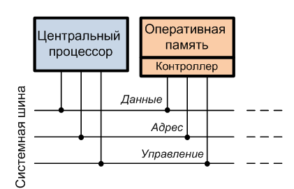

*Связь процессора и ОП через системную шину: данные, адрес, управление.*

Вопросы: в каком виде хранятся данные и команды? Откуда процессор знает, где лежит очередная команда и данные?

---

## 2. Представление данных

Числа в ЭВМ хранятся в двоичной системе счисления. Форматы: со знаком, с фиксированной и плавающей точкой. Символы хранятся своими двоичными кодами. Двоичные векторы хранятся последовательностями битов (обычно беззнаковые целые).

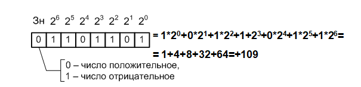

*Пример: 01101101 = +109. Старший бит - знак (0 - плюс, 1 - минус).*

---

## 3. Представление команд

Команда - это приказ компьютеру выполнить операцию, например сложение двух чисел (операндов) из ОП. Формат команды: код операции, адрес первого операнда, адрес второго операнда.

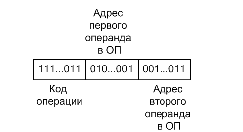

*Формат команды: КОП, адрес первого операнда, адрес второго операнда.*

---

## 4. Система команд процессора

Каждый процессор имеет свой набор команд - систему команд. Туда входят арифметические и логические команды, пересылка данных между регистрами и памятью, передача управления, ввод-вывод. Данные о системе команд берут из справочников.

Пример - фрагмент системы команд микроконтроллера KM1816BE51.

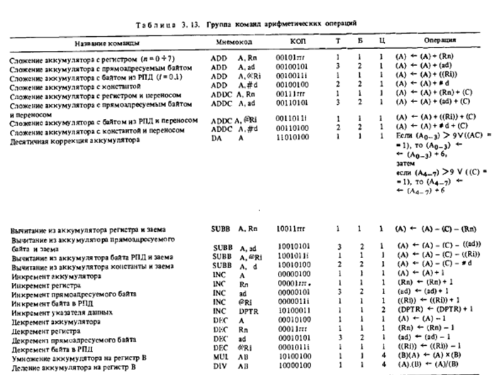

*Таблица арифметических команд: ADD, ADDC, DA, SUBB, INC, DEC, MUL, DIV.*

---

## 5. Аппаратное обеспечение

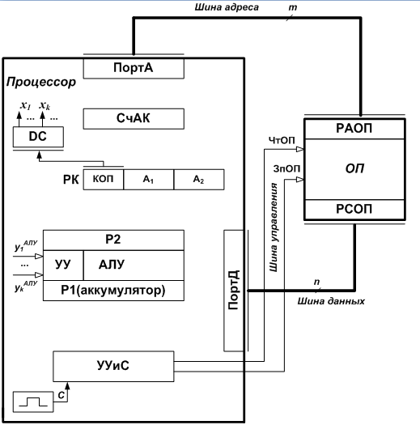

*Структурная схема: процессор, ОП, шины адреса/данных/управления, регистры, АЛУ, УУиС.*

Что входит в процессор:

- УУиС - устройство управления и синхронизации, управляет всеми блоками.
- СчАК - счетчик адреса команды, хранит адрес очередной команды.
- РК - регистр команд, хранит выбранную команду.
- АЛУ - имеет два регистра, один из них аккумулятор (Р1).
- ПортА - подключен к шине адреса.
- ПортД - подключен к шине данных.

Регистры ОП: РАОП (адрес), РСОП (слово).

---

## 6. Работа с оперативной памятью

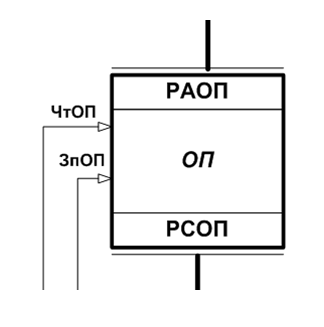

*Схема ОП: РАОП, ОП, РСОП, сигналы ЧтОП и ЗпОП.*

Чтение: процессор выставляет адрес в РАОП, подает сигнал ЧтОП. Данные появляются в РСОП и идут по шине данных в порт данных.

Запись: процессор выставляет адрес в РАОП, данные в РСОП, подает сигнал ЗпОП.

---

## 7. Рабочий цикл процессора

Рассмотрим двухадресную арифметическую (или логическую) команду.

*Формат команды: КОП, адрес второго операнда.*

### Этап 1. Выборка команды из ОП

1. y1: ПортА := СчАК.
2. y2: ЧтОП.
3. y3: РК := ПортД.

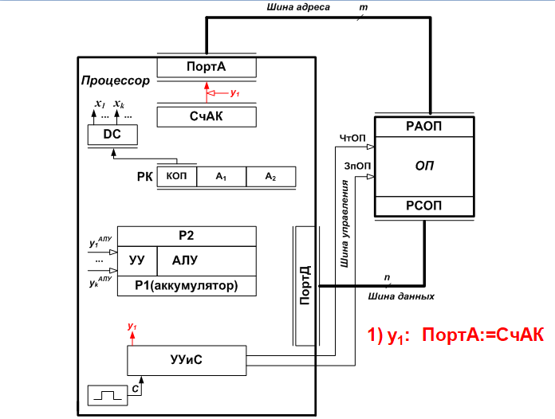

*Сигнал y1: ПортА := СчАК.*

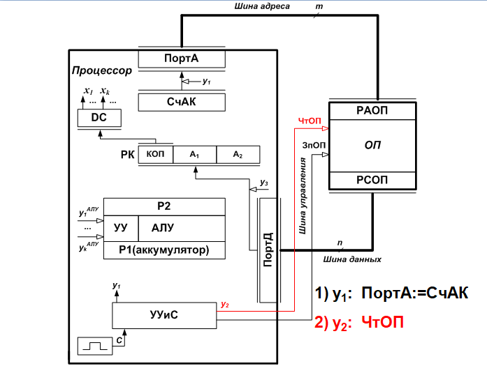

*Сигналы y1, y2: ЧтОП.*

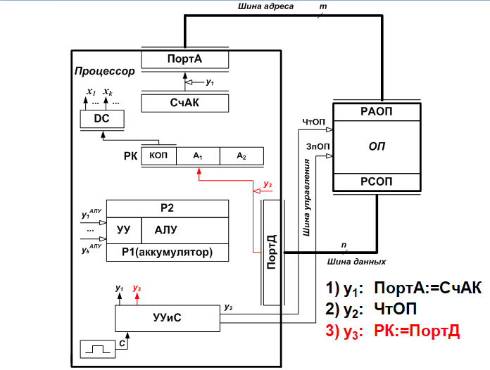

*Сигналы y1, y2, y3: РК := ПортД.*

### Этап 2. Выборка операндов из ОП

#### 2.1. Первый операнд

4. y4: ПортА := A1.
5. y2: ЧтОП.
6. y5: Р1 := ПортД.

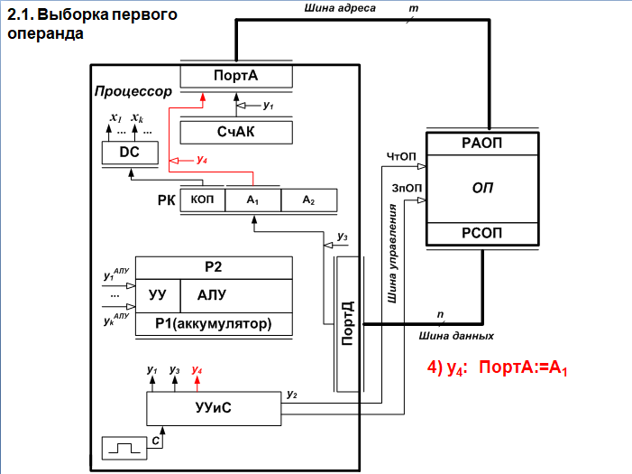

*Сигнал y4: ПортА := A1.*

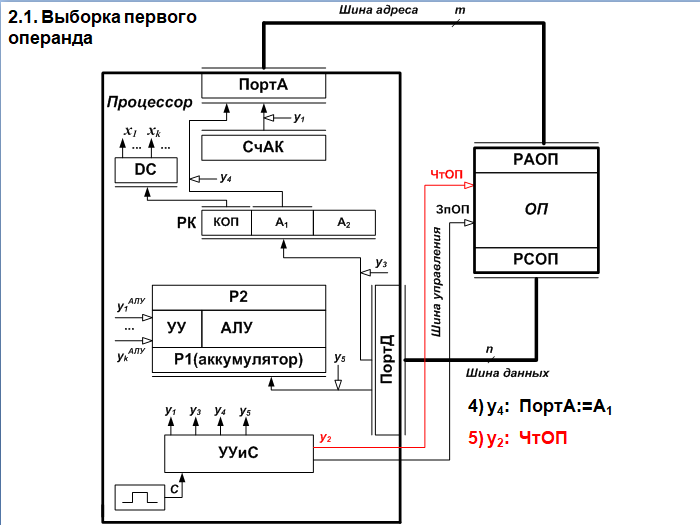

*Сигналы y4, y2: ЧтОП.*

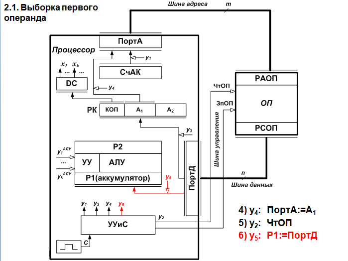

*Сигналы y4, y2, y5: Р1 := ПортД.*

#### 2.2. Второй операнд

7. y6: ПортА := A2.
8. y2: ЧтОП.
9. y7: Р2 := ПортД.

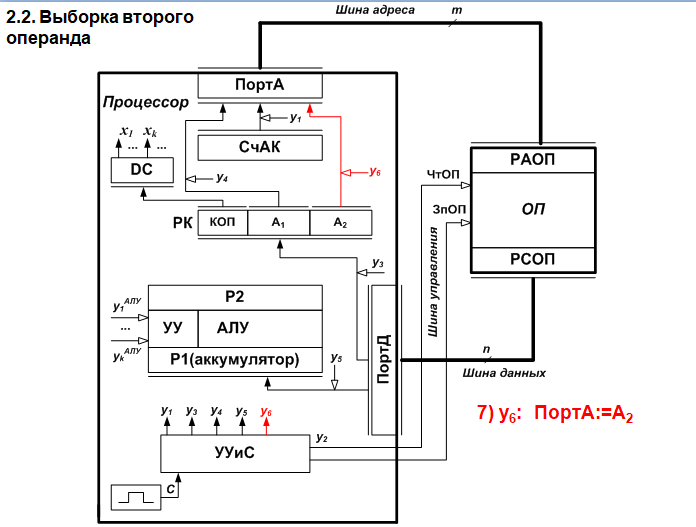

*Сигнал y6: ПортА := A2.*

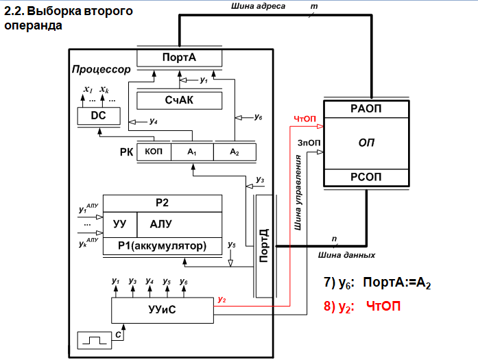

*Сигналы y6, y2: ЧтОП.*

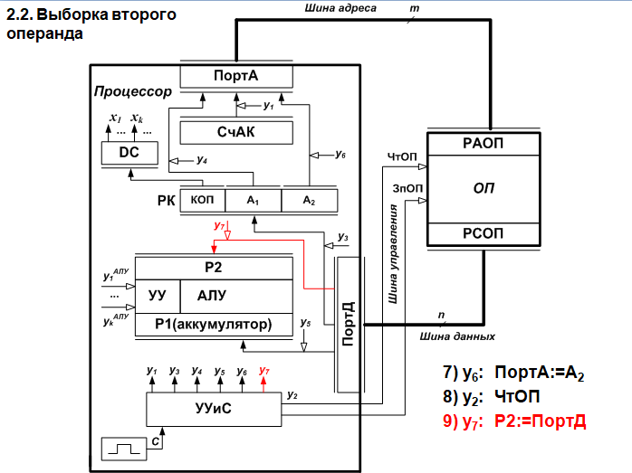

*Сигналы y6, y2, y7: Р2 := ПортД.*

### Этап 3. Выполнение операции в АЛУ

10. КОП -> DC -> xi -> УУиС -> yi -> АЛУ.

*КОП расшифровывается на DC, УУиС выдает yiАЛУ, АЛУ выполняет микропрограмму, результат в Р1.*

### Этап 4. Запись результата в ОП

11. y8: ПортД := Р1.
12. y4: ПортА := A1.
13. y9: ЗпОП.

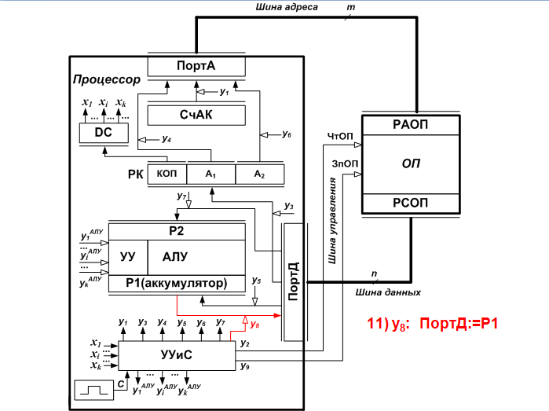

*Сигнал y8: ПортД := Р1.*

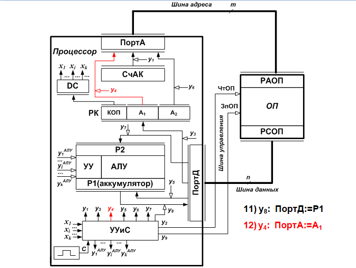

*Сигналы y8, y4: ПортА := A1.*

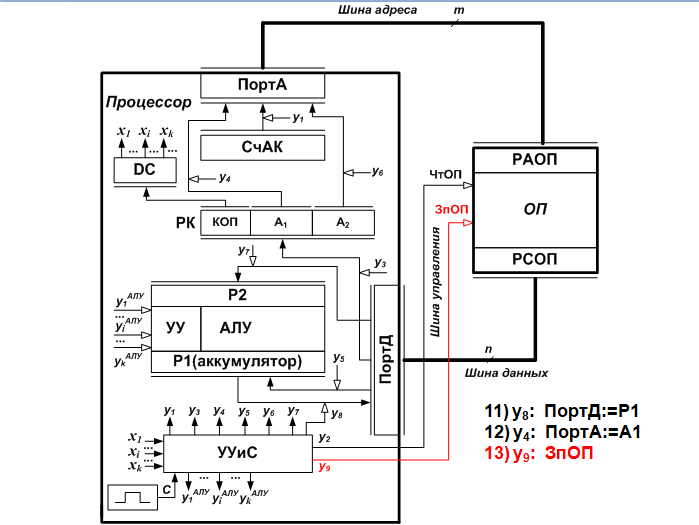

*Сигналы y8, y4, y9: ЗпОП.*

### Этап 5. Продвижение СчАК

14. y10: СчАК := СчАК + L.

*СчАК увеличивается на длину команды L.*

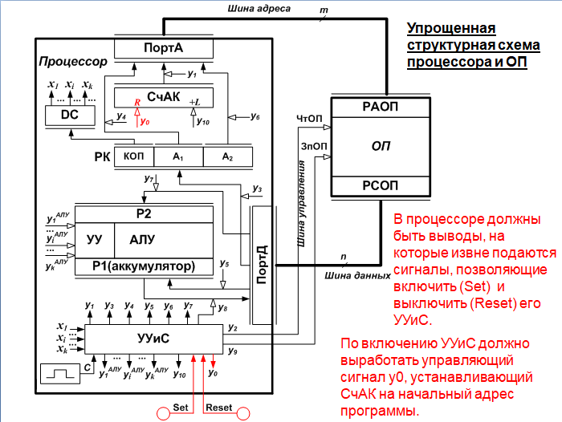

*Упрощенная структурная схема процессора и ОП.*

*УГО процессора: +5V, RESET, SET, CLC, GND, порты A, D, RD, WR, IN, OUT.*

Микропрограмма работы процессора:

y0, y1, y2, y3, y4, y2, y5, y6,
y2, y7, y8, y4, y9, y10, y1, y2,
y3, y4, y1, y2, y3, y4, y1, y2,
y1, y2, y3, y4, y1, y2, y3, y4,
y1, y2, y3, ...

## Пример с адресами

В СК - адрес текущей команды, в РК - предыдущая команда, в АЛУ - операнд и результат.

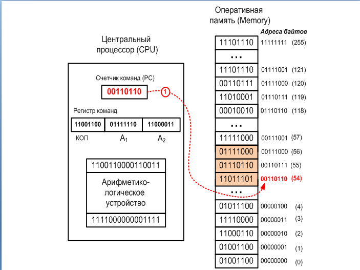

*Шаг 1: процессор выставляет СчАК на шину адреса.*

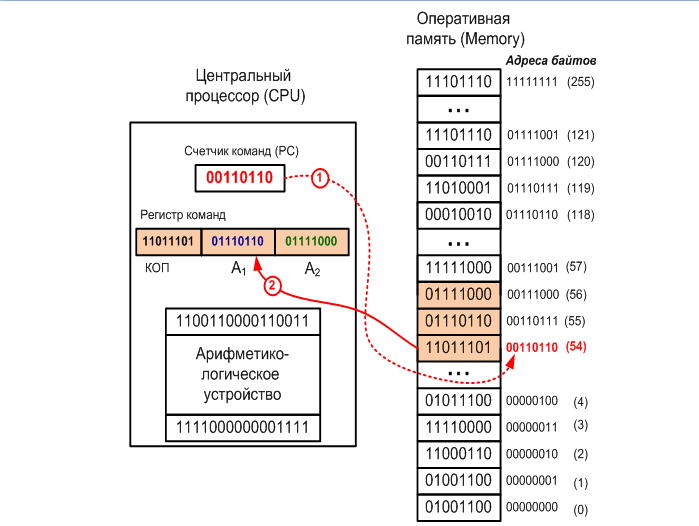

*Шаг 2: чтение команды из ОП в РК.*

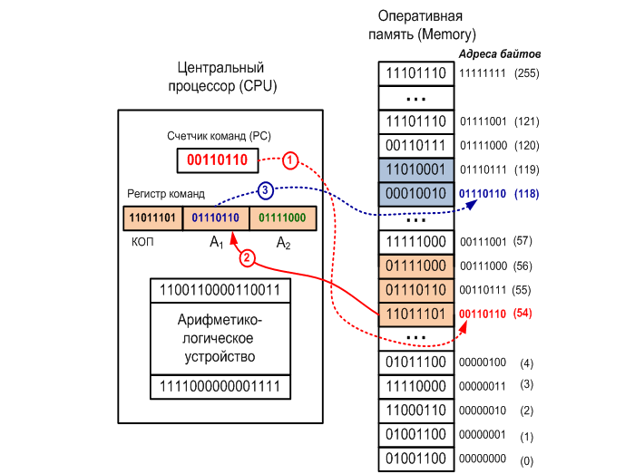

*Шаг 3: адрес первого операнда на шину адреса.*

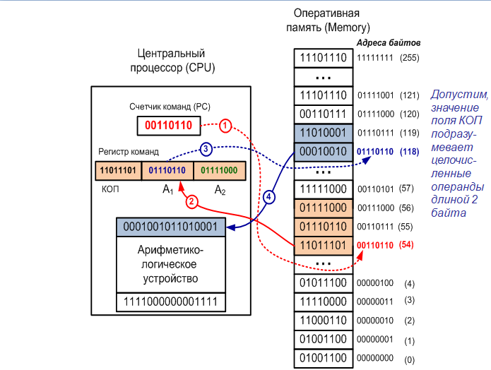

*Шаг 4: чтение первого операнда в Р1.*

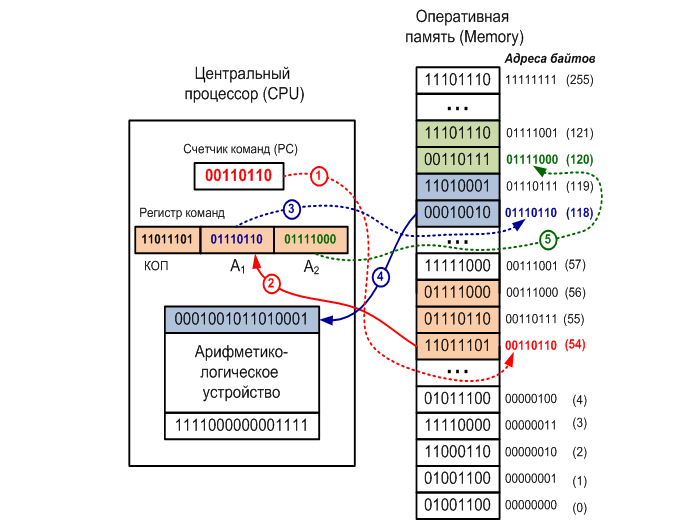

*Шаг 5: адрес второго операнда на шину адреса.*

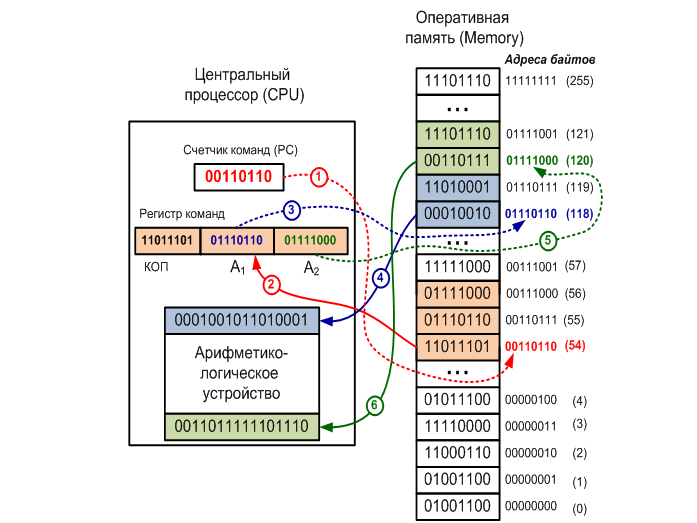

*Шаг 6: чтение второго операнда в Р2.*

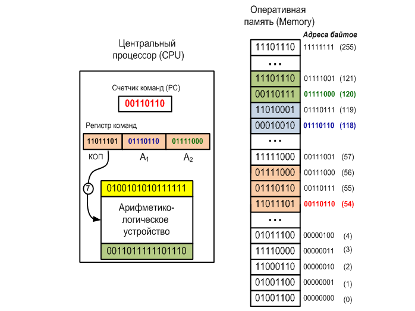

*Шаг 7: выполнение операции в АЛУ.*

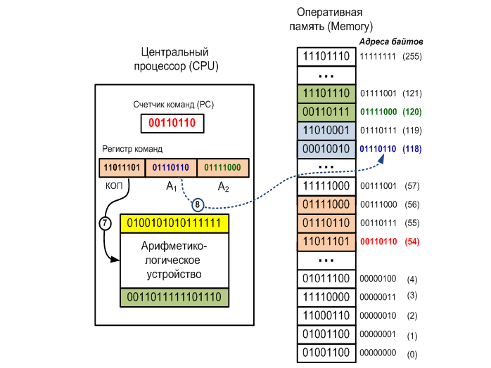

*Шаг 8: адрес первого операнда для записи.*

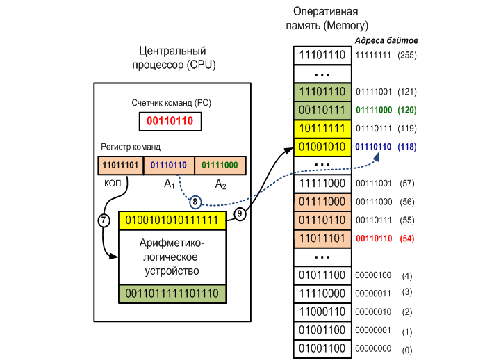

*Шаг 9: запись результата в ОП.*

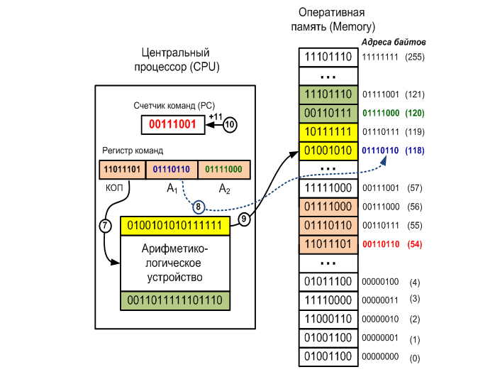

*Шаг 10: продвижение СчАК на длину команды.*

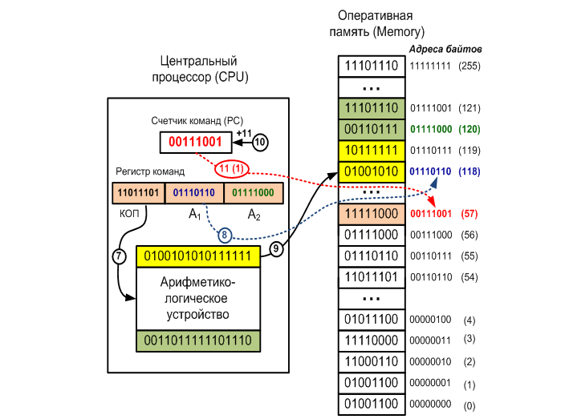

*Шаг 11: переход к следующей команде.*

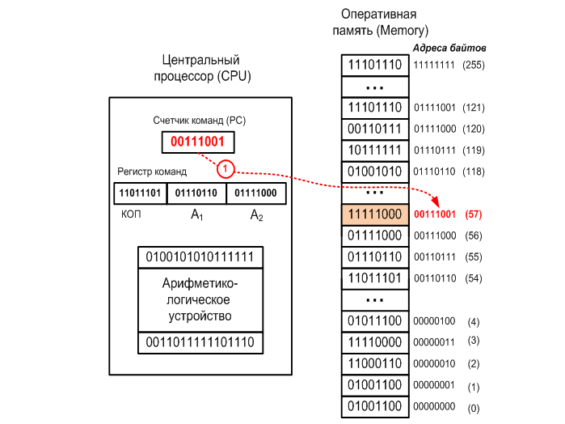

*Шаг 12: процесс повторяется.*

---

## 8. Детализация АЛУ

*Общая схема АЛУ: операнд 1, операнд 2, управляющие сигналы, результат.*

*АЛУ с ШАЛУ, Coder, РПР, РФ, сигналами y1...y12, ZАЛУ.*

Как работает АЛУ: после загрузки операндов процессор инициирует микропрограмму. АЛУ ставит ZАЛУ = 1 (занято). Когда ZАЛУ = 0 - операция закончена, результат в Р1.

Признаки результата (ШАЛУ):

- ШАЛУ(0)=1, если Р1=0;
- ШАЛУ(1)=1, если Р1<0;
- ШАЛУ(2)=1, если Р1>0;
- ШАЛУ(3)=1, если переполнение с фиксированной точкой.

Coder превращает унитарный код в позиционный: 00 - ноль, 01 - меньше нуля, 10 - больше нуля, 11 - переполнение.

Флаги исключительных ситуаций:

- ШАЛУ(4)=1 - переполнение порядка;
- ШАЛУ(5)=1 - исчезновение порядка;
- ШАЛУ(6)=1 - потеря значимости;
- ШАЛУ(8)=1 - деление на ноль.

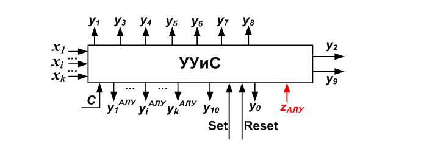

*Схема УУиС: входы x1...xk, C, Set, Reset, ZАЛУ, выходы y1...y10, y1АЛУ...ykАЛУ.*

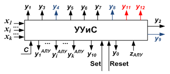

*Схема с сигналами y11, y12: РПР, РФ.*

При записи результата дополнительно: y11 записывает в РПР признак, y12 записывает в РФ флаги. Другие команды РПР не меняют. Если ШАЛУ(3:7)=00000 - исключительной ситуации не было.

---

## 9. Команды перехода

После арифметической команды СчАК продвигается на длину команды. Для перехода к произвольной команде служат команды перехода.

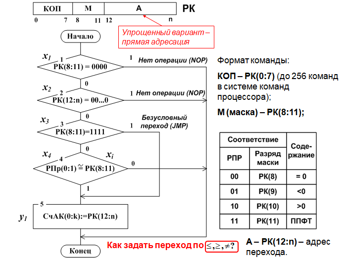

*Алгоритм команды условного перехода по маске.*

Формат: КОП - РК(0:7), М (маска) - РК(8:11), А (адрес) - РК(12:n).

Описание:

- Если в М или А нули - перехода нет (нет операции).
- Если в М все единицы - безусловный переход.
- Если признак результата совпадает с кодом в М - СчАК заменяется на адрес А.

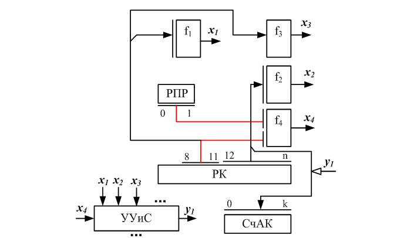

*Схема процессора для команды перехода: f1, f2, f3, f4, РПр, РК, СчАК, УУиС.*

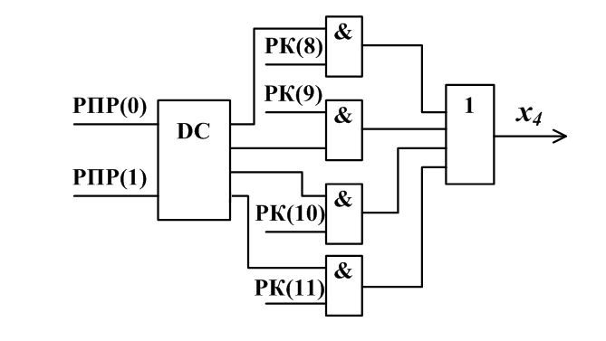

*Схема вычисления сигнала x4: РПр(0), РПр(1), DC, PK(8)...PK(11).*

---

## 10. Прерывания

Для поддержки прерываний в процессор введены регистр флагов (РФ) и указатель стека (УС).

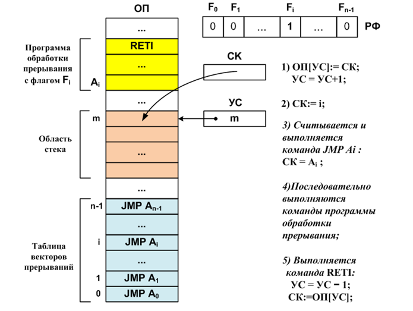

*Схема обработки прерывания: ОП, стек, ТВП, РФ, СК, УС, RETI.*

Алгоритм обработки:

1. ОП[УС] := СК; УС := УС + 1.
2. СК := i.
3. Выполняется JMP Ai.
4. Выполняется программа обработки.
5. RETI: УС := УС - 1; СК := ОП[УС].

Типы прерываний:

- Исключения (деление на ноль, переполнение и т.п.) - не маскируются.
- От внешних устройств (клавиатура, ввод-вывод) - маскируются.

Для поддержки есть РФ (флаги прерываний) и РМ (маски). Число битов соответствует числу причин. Если бит в РМ = 1, прерывание не обрабатывается.

Таблица векторов прерываний (ТВП) - первые n слов в ОП. В i-м слове - команда JMP Ai на программу обработки.

Стек работает по принципу LIFO. При записи: в верхушку, УС увеличивается. При чтении: УС уменьшается, потом читаем.

Недостаток: сохраняется только адрес возврата. Регистры программист сохраняет сам. В некоторых системах сохраняют Слово состояния программы (ССП / PSW).