# Процессор: теория

---

## 1. Элементы процессора

Что входит в процессор:

- **Дешифратор команд** - понимает, что за команда пришла.
- **Операционные устройства** - выполняют вычисления (в том числе АЛУ).
- **Устройство управления (УУ)** - руководит всеми блоками.
- **Регистры** - хранят данные и адреса.
- **Транслятор адресов операндов** - превращает адрес в физический.
- **Шины** - внутренняя и внешняя, по ним идут данные.

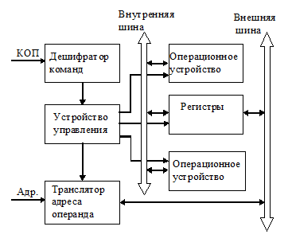

*Структурная схема элементов процессора. Показаны дешифратор команд, устройство управления, операционные устройства, регистры, транслятор адресов, внутренняя и внешняя шины. Стрелки показывают потоки команд (КОП), адресов (Адр.) и данных.*

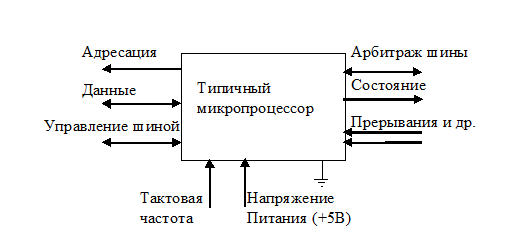

*Типичный микропроцессор. Показаны внешние интерфейсы: адресация, данные, управление шиной, арбитраж шины, состояние, прерывания, тактовая частота, питание +5В.*

### Немного истории

В 1971 году вышел первый микропроцессор - **Intel 4004**. По мощности он был как ENIAC, но стоил 200 долларов. Внутри было 2300 транзисторов, потреблял десятки ватт, работал на частоте 108 КГц.

---

## 2. Операционные устройства

Какие бывают операционные устройства:

- целочисленная арифметика;
- логические операции;
- сдвиги;
- десятичная арифметика;
- числа с плавающей запятой;
- графические операции.

**Структурный базис** - это набор элементов, из которых строят операционные устройства:

- **Регистры** - хранят слова данных.
- **Шины** - соединяют регистры, передают данные.
- **Комбинационные схемы** - считают по управляющим сигналам.

### Регистры

**Регистр** - это линейка триггеров. У нее есть входы, которые меняют состояние, и выходы.

Какие бывают регистры:

- программно-видимые (доступны программисту напрямую);
- видимые косвенно (например, теневые регистры дескрипторов сегментов);
- внутренние специальные (регистр адреса памяти, регистр данных);
- внутренние для промежуточных результатов.

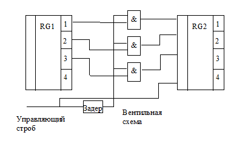

*Схема регистров RG1 и RG2 с вентильной схемой. Показаны управляющий строб, задержка, вентили &, регистры-приемники.*

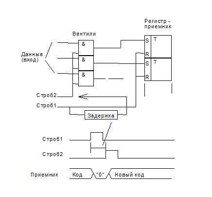

*Временная диаграмма работы регистра-приемника. Показаны стробы 1 и 2, данные, код «0» и «Новый код».*

---

## 3. АЛУ (Арифметико-логическое устройство)

**АЛУ** - это схема без памяти. Она получает два операнда и выдает результат.

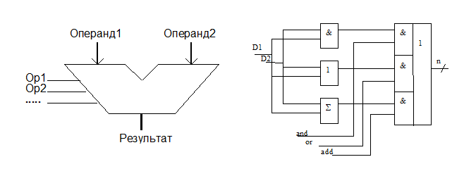

*Условное обозначение АЛУ. Два входа (Операнд1, Операнд2), управляющие сигналы Op1, Op2, …, выход Результат.*

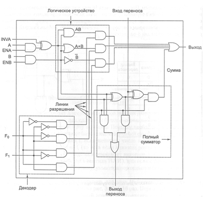

*Схема АЛУ на логических элементах. Показаны входы D1, D2, элементы &, 1, Σ, управляющие сигналы and, or, add, выход n.*

### Из чего состоит АЛУ

- логическое устройство;
- полный сумматор;
- декодер операции.

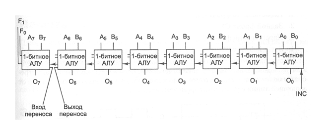

*Многоразрядное АЛУ. Показаны 1-битные АЛУ, входы A0…A7, B0…B7, выходы O0…O7, вход переноса INC, выход переноса.*

---

## 4. Простейшие операционные устройства

Примеры простых команд:

- **Пересылка** `mov R1, R2` - перекинуть данные из регистра в регистр.
- **Сдвиг** `rol R0` - циклический сдвиг.
- **Сложение** `add R0, R1` - сложить и записать результат.

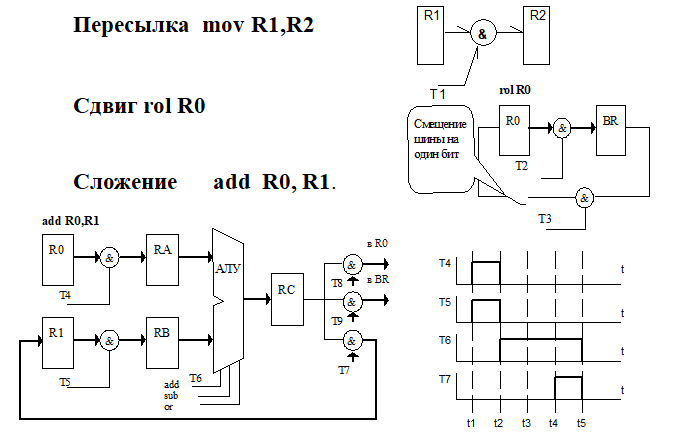

*Схемы выполнения команд mov, rol, add. Показаны регистры R0, R1, R2, RA, RB, RC, АЛУ, управляющие сигналы T1…T9.*

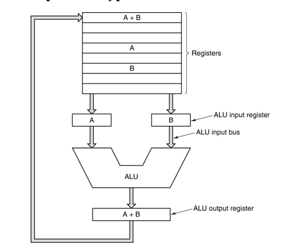

*Структура data path типичной фон-неймановской машины. Показаны регистры A, B, A+B, входные регистры АЛУ, АЛУ, выходной регистр.*

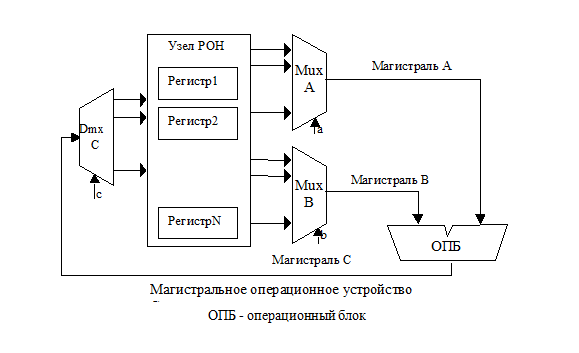

*Магистральное операционное устройство. Показаны узел РОН, мультиплексоры A и B, магистрали A, B, C, ОПБ, Dmx C.*

### Виды операционных устройств с магистральной структурой

- **Трехмагистральное ОПУ** - три шины A, B, C.
- **Двухмагистральное ОПУ** - две шины A, B.
- **Одномагистральное ОПУ** - одна шина A.

---

## 5. Устройство управления

### Что делает УУ

Устройство управления (УУ) ведет весь вычислительный процесс:

- дает сигналы на выборку команды из ОЗУ;
- расшифровывает код операции;
- считает адреса операндов;
- выбирает операнды из ОЗУ;
- отправляет операнды в операционное устройство;
- запускает выполнение операции;
- пишет результат обратно в ОЗУ;
- запускает ввод/вывод;
- реагирует на прерывания.

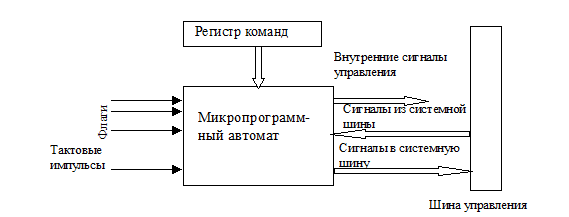

*Модель устройства управления. Показаны регистр команд, микропрограммный автомат, флаги, тактовые импульсы, внутренние сигналы управления, сигналы из системной шины и в системную шину.*

### Основные понятия

- **Микрооперация** - одно простое действие за один такт.
- **Микрокоманда** - набор микроопераций, которые делаются одновременно.
- **Микропрограмма** - последовательность микрокоманд, задающая машинный цикл.

### Из чего состоит УУ

**Управляющая часть:**

- регистр команды;
- микропрограммный автомат (+ дешифратор команд);
- узел прерываний и приоритетов.

**Адресная часть:**

- операционный узел УУ;
- регистр адреса;
- счетчик команд.

---

## 6. Микропрограммный автомат с жесткой логикой

Как он работает:

- сигналы управления задаются раз и навсегда собранной логикой;
- КОП определяет, какие сигналы и в каком порядке пойдут;
- сигналы привязаны к тактовым импульсам;
- счетчик тактов сбрасывается в конце цикла команды;
- разным командам нужно разное число тактов;
- на сигналы также влияют флаги.

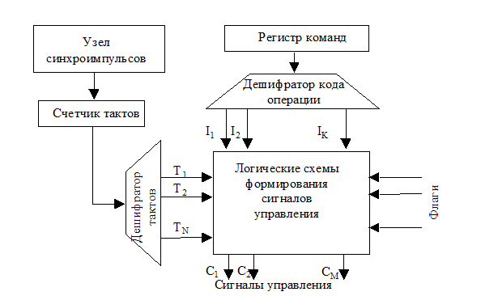

*Схема микропрограммного автомата с жесткой логикой. Показаны узел синхроимпульсов, счетчик тактов, дешифратор тактов, регистр команд, дешифратор кода операции, логические схемы формирования сигналов управления, флаги, сигналы управления C1…CM.*

---

## 7. Микропрограммный автомат с программируемой логикой

Идею в 1951 году предложил **Морис Уилкс**. Появился третий уровень: команда → микропрограмма → сигналы управления. Аппаратуры стало нужно меньше.

Особенности:

- есть память микропрограмм;
- каждой команде соответствует своя микропрограмма;
- к 70-м годам так делали почти везде;
- в современных процессорах от этого отказались - тормозит производительность.

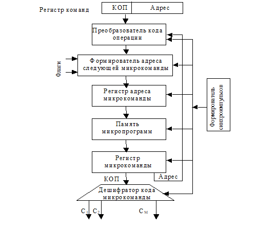

*Микропрограммный автомат с программируемой логикой. Показаны регистр команд (КОП, Адрес), преобразователь кода операции, формирователь адреса следующей микрокоманды, регистр адреса микрокоманды, память микропрограмм, регистр микрокоманды, дешифратор кода микрокоманды, формирователь синхроимпульсов, флаги, сигналы C1…CM.*

---

## 8. Пример процессора с тремя шинами и микропрограммирование

**Микрокоманда GATE** - биты соответствуют стробам (вентилям), есть признак GATE.

**Микрокоманда TEST** - адрес перехода, проверяемый бит, регистр, признак TEST.

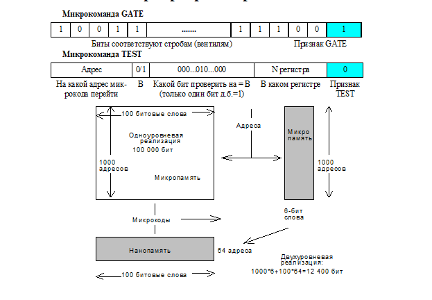

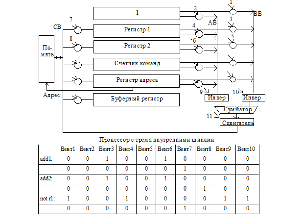

*Процессор с тремя внутренними шинами. Показаны память, регистр 1, регистр 2, счетчик команд, регистр адреса, буферный регистр, инверторы, сумматор, сдвигатель, вентили 1…11, шины AB, BB, CB.*

**Таблица:** Примеры микрокоманд для вентилей 1…10 (add1, add2, not r1).

---

## 9. Архитектуры систем команд

Бывают такие архитектуры:

- стековая;
- аккумуляторная;
- регистровая;
- с выделенным доступом к памяти.

### Стековая архитектура

Стек работает по принципу **LIFO** (последний вошел - первый вышел). Есть две операции: `push` (положить) и `pop` (взять). Писать можно только в верхнюю ячейку.

**Обратная польская запись** - без скобок, знак операции после операндов. Пример: `a = a + b + a × c` → `a = a b + a c × +`.

### Аккумуляторная архитектура

Аккумулятор - регистр, где лежит один из операндов и результат. Второй операнд берется из памяти. Команды: `load x`, `store x`.

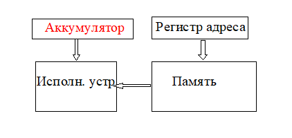

*Аккумуляторная архитектура. Показаны аккумулятор, регистр адреса, исполнительное устройство, память.*

Плюсы: команды короткие, декодировать просто. Минус: часто лезем в память.

### Регистровая архитектура

В процессоре есть набор регистров (РОН). Размер регистров фиксирован. Команды бывают: регистр-регистр, регистр-память, память-память.

[Register architecture](./screenshots/register_architecture.png)

*Регистровая архитектура. Показаны General Registers (gr0…gr127) и Floating-point Registers (fr0…fr127).*

Плюсы: код компактный, считается быстро. Минус: инструкции длиннее.

### Архитектура с выделенным доступом к памяти

В память можно только через `load` и `store`. Все операнды - в регистрах. Так делают в RISC. Примеры: Sun SPARC, MIPS R10000, DEC Alpha, PowerPC.

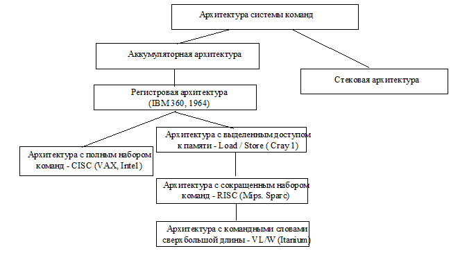

*Классификация архитектур системы команд. Показаны аккумуляторная, регистровая (IBM 360), стековая, с выделенным доступом (Cray 1), CISC (VAX, Intel), RISC (Mips, Sparc), VLIW (Itanium).*

---

## 10. Конфигурируемые процессоры Xtensa (Tensilica)

Средство **Xenergy** от Tensilica позволяет посмотреть, как конфигурация процессора влияет на потребление энергии. Можно менять конфигурацию, добавлять команды, регистровые файлы, оптимизировать код.

---

## 11. Процессор Intel 8086

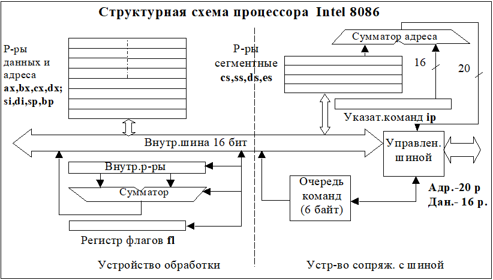

*Структурная схема процессора Intel 8086. Показаны регистры данных и адреса (ax, bx, cx, dx; si, di, sp, bp), сегментные регистры (cs, ss, ds, es), указатель команд ip, сумматор адреса, внутренняя шина 16 бит, АЛУ, регистр флагов fl, очередь команд (файт), устройство управления шиной, устройство обработки, устройство сопряжения с шиной.*

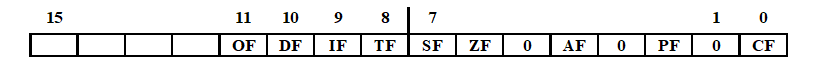

*Регистр флагов процессора 8086. Показаны биты 15…0: CF, PF, AF, ZF, SF, TF, IF, DF, OF.*

Что означают флаги:

- CF - перенос;
- PF - четность;
- AF - вспомогательный перенос;
- ZF - ноль;
- SF - знак;
- TF - прерывание для отладки;
- IF - разрешение прерывания;
- DF - направление цепочечных команд;
- OF - переполнение.

### Конвейер. Организация памяти. Сегментация

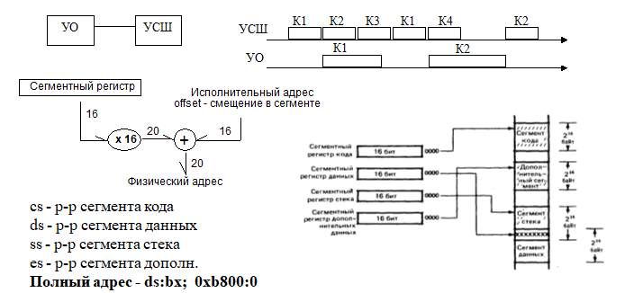

*Конвейер. Организация памяти. Сегментация. Показаны УО и УСШ, временная диаграмма K1…K4; сегментный регистр, умножитель на 16, сумматор, физический адрес 20 бит, сегменты кода, данных, стека, дополнительных данных.*

Сегментные регистры: cs, ds, ss, es. Полный адрес: `ds:bx`, пример `0xb800:0`.

Команды для работы с адресами: `int iA;`, `int far *pA=&iA;`, `lea bx, iA;`, `les bx,pA`.

Модели памяти: Tiny, Small, Medium, Compact, Large, Huge.

---

## 12. Форматы команд i8086

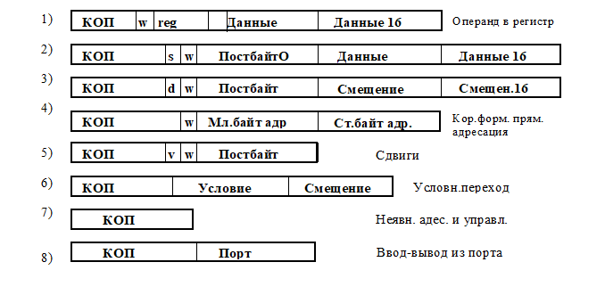

*Форматы команд. Показаны:*

1. КОП, w, reg, данные (16) - операнд в регистр.
2. КОП, s, w, постбайт, данные (16).
3. КОП, d, w, постбайт, смещение, смещение 16.
4. КОП, w, млб адр, стб адр - прямая адресация.
5. КОП, v, w, постбайт, сдвиги.
6. КОП, условие, смещение - условный переход.
7. КОП - неявный адрес и управление.
8. КОП, порт - ввод-вывод из порта.

### Особенности команд i8086

- Это CISC-архитектура.
- Всего команд: 538 (целочисленные - 210, плавающая точка - 85, MMX - 57, MMX Pentium III - 16, XMM - 70).
- Базовая структура - два операнда.
- Длина команды - от 1 до 15 байтов.
- Форматы кодирования сложные.
- Способы адресации многокомпонентные.
- Регистры и команды сильно специализированы (не ортогональны).
- Команды пересылки флаги не меняют.